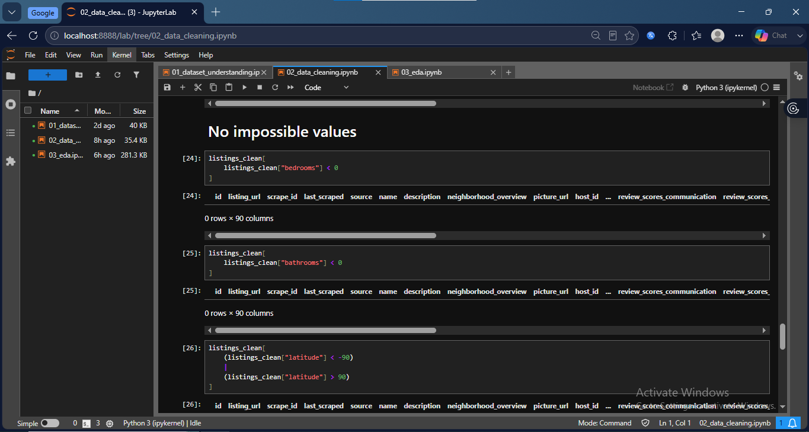
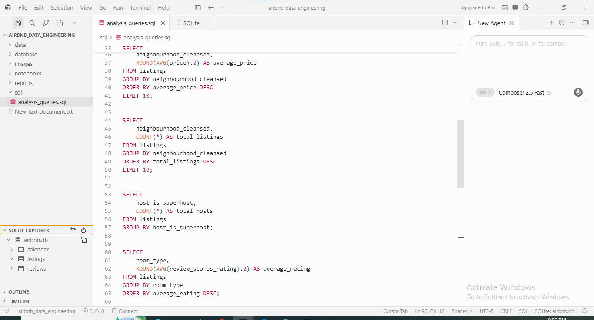
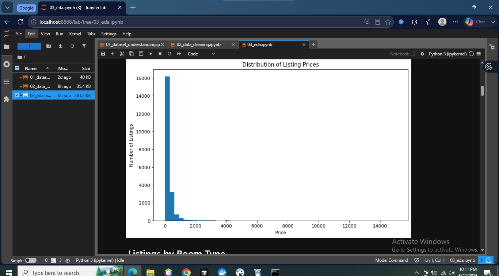
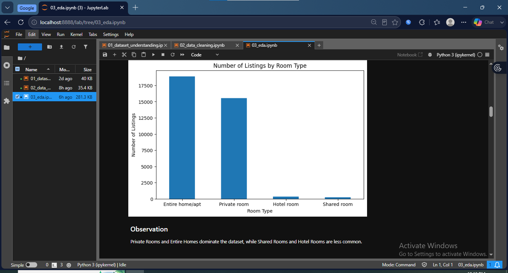
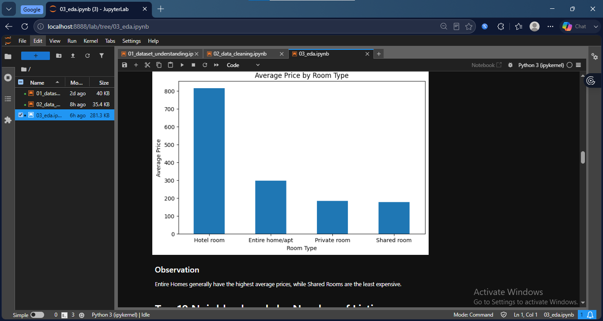
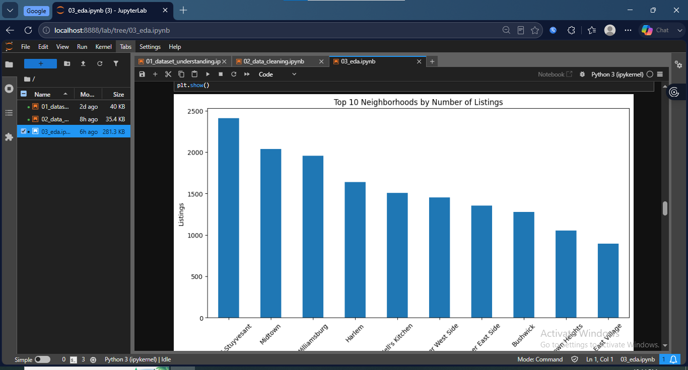
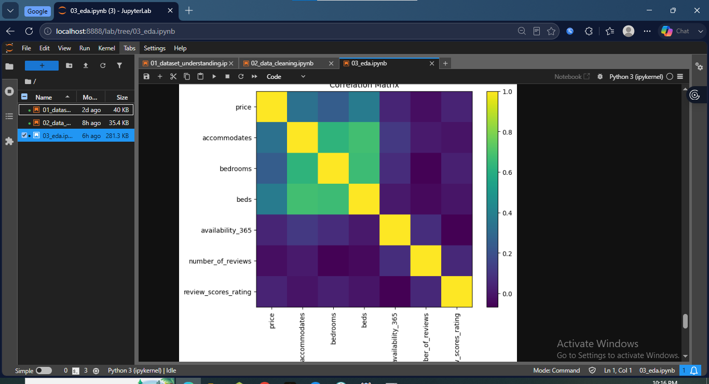
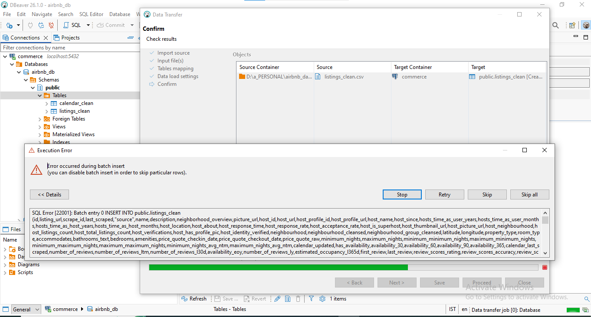

# Airbnb Data Engineering Project - Final Report

## 1. Introduction

### Project Objective

The objective of this project was to perform an end-to-end data engineering workflow using the Airbnb dataset. The project involved understanding the datasets, assessing data quality, cleaning and transforming the data, storing the cleaned data in a SQLite database, performing SQL analysis, and conducting Exploratory Data Analysis (EDA) to generate meaningful business insights.

The project demonstrates fundamental data engineering skills including data preprocessing, database management, SQL querying, and data visualization.

---

# 2. Dataset Overview

The project consists of three datasets:
(City - NewYork)

| Dataset  | Description                                   |
| -------- | --------------------------------------------- |
| Listings | Information about Airbnb properties and hosts |
| Reviews  | Guest reviews for each listing                |
| Calendar | Daily availability information for listings   |

### Dataset Relationships

```
Host
   │
   │
   ▼
Listings
  ├────────── Reviews
  │
  └────────── Calendar
```

Primary Keys

* Listings → id
* Reviews → id
* Calendar → listing_id + date

---

# 3. Data Cleaning Summary

Several preprocessing steps were performed to improve the quality of the datasets before analysis.

### Cleaning Tasks Performed

* Removed duplicate records
* Identified missing values
* Converted date columns to datetime format
* Converted price columns to numeric values
* Removed currency symbols from price fields
* Verified data types
* Checked for invalid values
* Exported cleaned datasets for further analysis

The cleaned datasets were stored inside the **data/processed/** directory.

---

## 📷 Screenshot 1



---

# 4. Database Creation

The cleaned datasets were imported into a SQLite database.

Database Name

```
airbnb.db
```

Tables Created

* listings
* reviews
* calendar

SQLite was selected because it is lightweight, easy to configure, and suitable for local analytical projects.

---

## 📷 Screenshot 2



---

# 5. SQL Analysis

SQL queries were written to analyze the cleaned datasets.

The analysis included:

* Total listings
* Total reviews
* Total calendar records
* Listings by room type
* Average price by room type
* Top neighborhoods by listings
* Most expensive neighborhoods
* Review statistics
* Availability statistics
* Property type analysis

These SQL queries demonstrated the use of:

* SELECT
* WHERE
* GROUP BY
* ORDER BY
* COUNT()
* AVG()
* MAX()
* MIN()
* LIMIT

---

## 📷 Screenshot 3

.png)

---

## 📷 Screenshot 4

.png)

---

# 6. Exploratory Data Analysis (EDA)

Exploratory Data Analysis was conducted using Python and Matplotlib.

Several visualizations were created to better understand the characteristics of the Airbnb listings.

The analyses included:

* Price Distribution
* Listings by Room Type
* Average Price by Room Type
* Top Neighborhoods
* Average Price by Neighborhood
* Review Score Distribution
* Correlation Matrix

These visualizations provide a clear understanding of pricing trends, listing distribution, and customer review behavior.

---

## 📷 Screenshot 5



---

## 📷 Screenshot 6



---

## 📷 Screenshot 7



---

## 📷 Screenshot 8



---

## 📷 Screenshot 9



---

# 7. Key Findings

The analysis revealed several important insights:

* Most Airbnb listings are Private Rooms and Entire Homes.
* Entire Homes have the highest average listing prices.
* Listing prices are positively skewed, with relatively few expensive properties.
* Review ratings are generally high, indicating positive guest experiences.
* A small number of neighborhoods contain a significant proportion of listings.
* Average listing prices vary considerably across neighborhoods.
* Availability differs substantially between listings, suggesting different hosting strategies.

---

# 8. Challenges Encountered

During the project, several technical challenges were encountered.

* Handling missing values across multiple datasets.
* Cleaning currency-formatted price columns.
* Managing large datasets, particularly the Calendar dataset.
* Importing cleaned datasets into a SQLite database.
* Executing SQL analysis on the generated database.

These challenges were successfully resolved through appropriate preprocessing and database management techniques.

---

# 9. Technologies Used

| Technology       | Purpose                    |
| ---------------- | -------------------------- |
| Python           | Data Cleaning and Analysis |
| Pandas           | Data Manipulation          |
| Matplotlib       | Data Visualization         |
| SQLite           | Database                   |
| SQL              | Data Analysis              |
| Jupyter Notebook | Development Environment    |

---

# 10. Conclusion

This project successfully demonstrated a complete data engineering workflow, beginning with raw datasets and ending with structured data analysis and visualization.

The workflow included data understanding, preprocessing, database creation, SQL querying, and exploratory data analysis. The project highlights essential data engineering skills such as data cleaning, database management, SQL analysis, and communicating analytical insights through visualizations.

Overall, the p


# Appendix: Database Implementation Decision

Initially, PostgreSQL and DBeaver were selected as the database environment for this project because they are commonly used in production data engineering workflows. During the data import process, an issue occurred while importing the cleaned CSV files into PostgreSQL through DBeaver. The import failed because one or more text fields exceeded the default character length (`VARCHAR(2048)`) that had been automatically assigned during table creation.

The following error was encountered during the import process:




This issue was caused by very long text values in columns such as `host_about`, which exceeded the automatically generated column size.

To ensure the project could be completed successfully within the assignment timeline, SQLite was selected as an alternative database engine. SQLite does not require manual schema configuration for this type of analytical workload, allowing the cleaned datasets to be imported directly while preserving all data.

The change in database engine did **not** affect the objectives of the project. All required SQL analyses, aggregations, filtering operations, and exploratory data analysis were successfully completed using SQLite.

This decision demonstrates adaptability in selecting an appropriate technology when encountering implementation challenges while maintaining the project's analytical requirements.

